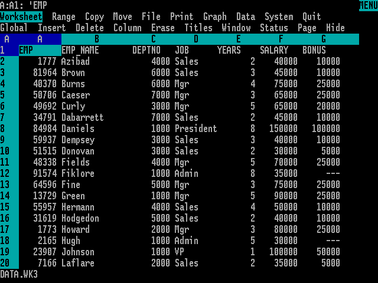
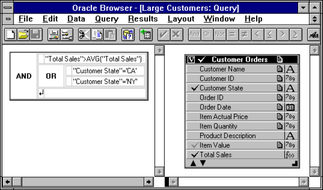
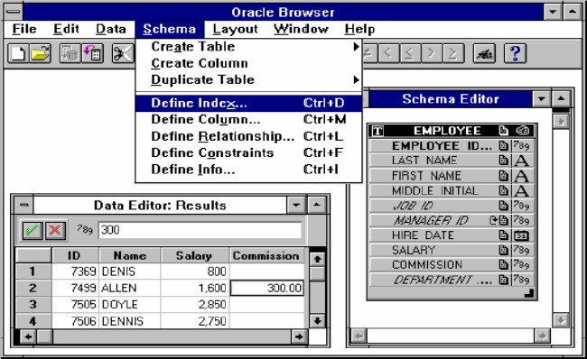
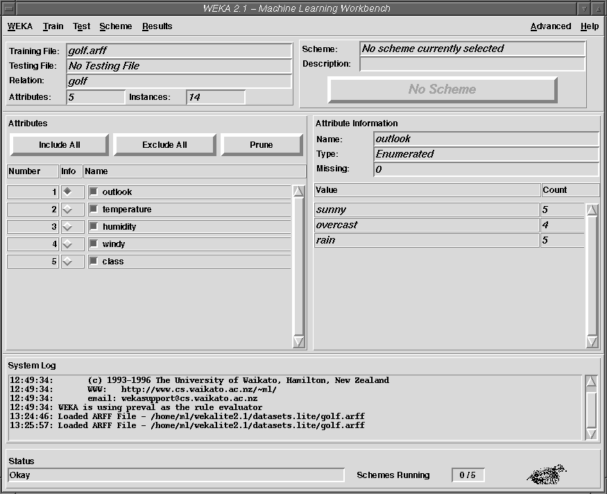
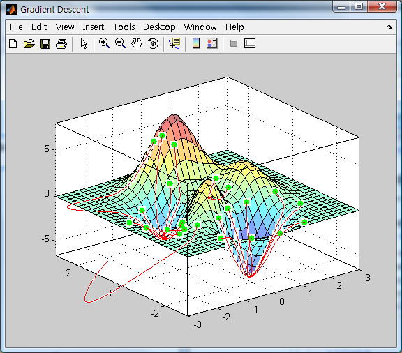
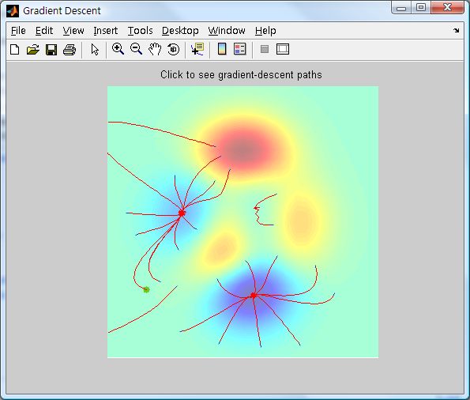
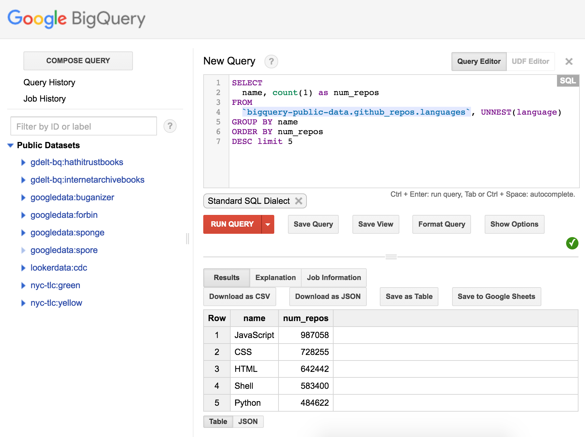

# The Rise of Data

<!--
Data... a collection of symbols representing the quality or quantity of a physical phenomenon.
-->

---

<!-- _class: title-two-content-left -->

<!--
Humans have likely been using data for as long as we've been counting on our fingers.
-->

---

<!-- _class: title-two-content-left -->

<!-- _footer: Source: Museum of Natural Sciences in Brussels, Belgium -->

<!--
We have evidence of humans carving notches into wood, bone, and stone to count days, lunar cycles, and animals for at least the past forty-thousand years.
-->

---

<!-- _footer: Source: Wikipedia: Babylonian Numerals -->

<!--
A few millennia ago, the Sumerians, Egyptians, and Chinese were recording written counts of items, animals, people, and astronomical observations.
-->

---

Source: Wikipedia -Venus tablet of Ammisaduqa

<!--
They recorded these data using clay tablets, papyrus, and parchment, using early writing systems like cuneiform, hieroglyphics, and logographs.
-->

---

<!--
A few centuries ago, data were collected by governments for census and taxation, or by businesses for accounting, inventory, and transactions.
-->

---

<!-- _footer: Source: Polltax Return, Hampshire, 1379 -->

<!--
Data at this point in history were recorded largely using quill pens in paper ledgers.
-->

---

<!-- _class: title-two-content-left -->

<!--
In the 1800s, mechanical computers radically sped up data processing and ushered in a new area of data analysis.
-->

---

<!-- _class: title-two-content-left -->

<!--
For example, the 1880 US census took over 7 years to process and analyze without a computer.
-->

---

<!-- _class: title-two-content-left -->

<!-- _footer: Source: Smithsonian National Museum of American History -->

<!--
However, the 1890 US census, took only 18 months thanks to Herman Hollerith's punch-card-based "Tabulating Machine".
-->

---

<!-- _class: title-two-content-left -->

<!-- _footer: Source: US Army -->

<!--
In the 1900s, electrical computers dramatically increased both data storage and processing capabilities.
-->

---

<!-- _class: title-two-content-left -->

#

<!-- _footer: Source: Texas A & M -->

<!--
By the mid-1900s, digital computers allowed us to store and analyze data as bits of information encoded as ones and zeros.
-->

---

<!-- _footer: Source: Odacir Blanco -->

<!--
In the 1980s, the emergence of relational databases allowed us to efficiently store and process transactional data.
-->

---

<!-- _class: title-one-content-left -->

SELECT ID, Last_Name, First_Name, Hire_Date
FROM Employees
ORDER BY Hire_Date
WHERE Department_ID = 10

ID           First_Name  Last_Name  Hire_Date
-----------  ----------  ---------  ---------
37           Bill        Smith      1980-08-02
28           Miko        Chen       1982-04-12
51           Amy         Lopez      1985-09-10

<!--
We also saw the emergence of programming languages like structured query language which allow us to rapidly query and analyze data.
-->

---

<!-- _class: title-two-content-left -->

<!--
In the 1990s, data warehouses, data marts, and data cubes were used to store and analyze ever-larger growing sets of data.
-->

---

<!-- _class: title-two-content-left -->

<!--
We also saw the emergence of data mining to allow us to discover patterns of interest in large data sets.
-->

---

<!-- _class: title-two-content-left -->

<!--
In the 2000s, big-data platforms emerged to handle very large data sets by spreading data and processing across several computers in a cluster.
-->

---

<!-- _class: title-two-content-left -->

<!--
We also saw the rise of machine learning - training computer algorithms on large sets of data to classify new data and make predictions.
-->

---

<!-- _class: title-two-content-left -->

<!--
In the 2010s, cloud-scale distributed computing platforms emerged to handle storing and processing of data across thousands of computers in a data center.
-->

---

<!-- _class: title-two-content-left -->

<!--
This decade also ushered in the era of deep learning - training deep neural networks on very large data sets to classify and predict much more complex patterns of data.
-->

---

<!-- _class: title-two-content-left -->

#

<!--
As we move into 2020s, the explosion of data from the internet of things is leading to a need for new methods to store and process data.
-->

---

<!-- _class: title-two-content-left -->

<!--
In addition, the demand for modern data analysis has made data science one of the most in-demand professions of the 21st century.
-->

---

<!-- _class: title-two-content-left -->

<!--
In the next decade and beyond, the field of data science will continue to grow and will likely evolve into data-driven artificial intelligence.

A new era of data that will almost certainly change our world in more ways than we could possibly imagine.
-->