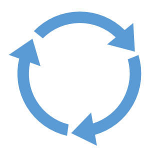
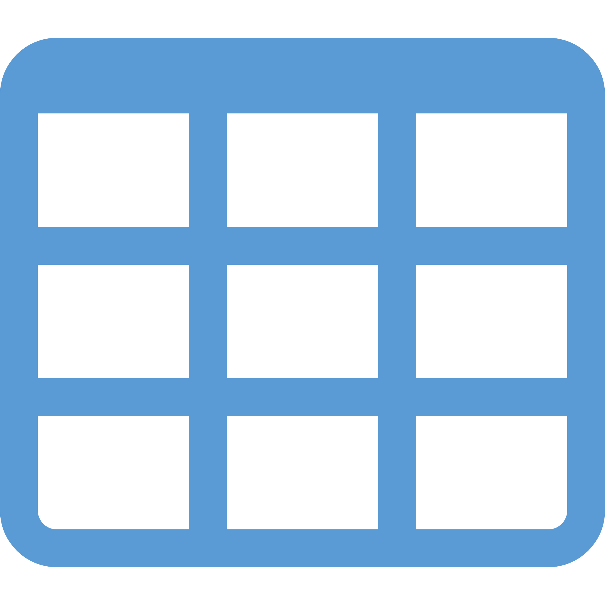
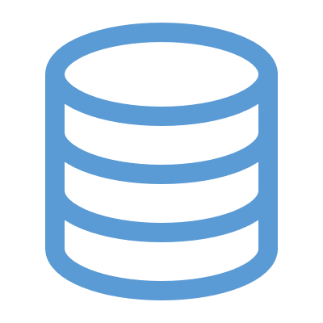

# Overview

---

<!-- _class: title-two-content-left -->

# Purpose

To learn about data as a foundation 
for data science

<!--
[1] The purpose of this course is to learn about data as a foundation for data science.

It might seem obvious, but half of data science is data, ...

... so as you can imagine, it's really important to have a thorough understanding of data to be successful with data science. 

This course was designed to provide you with that foundational knowledge.
-->

---

<!-- _class: title-five-content -->

# Overview

Data

Types of Data

Data Types

Tabular Data

Data Life Cycle

<!--
As an overview of this course:

[1] First, we'll learn about data. 

We'll learn what it is... and why it's important for data science.

[2] Next we'll learn about the various types of data we encounter in data science ...

... including categorical and numerical data.

[3] Then we'll learn about data types ...

... and how we represent and store various kinds of data in a computer.

[4] Next, we'll learn about data structures ...

... and how providing structure to data gives it additional context and meaning.

[5] Then, we'll learn about tabular data ...

... tables of data organized into rows and columns that allow us to perform queries.

[6] Finally, we'll learn about the data life cycle.

We'll learn about the journey of data as we move from raw data to actionable insight.
-->

---

<!-- _class: title-two-content-left -->

# Prerequisites

No 
prerequisite 
courses

No 
required 
software

<!--
[1] There are no prerequisites for this course.

We will assume you are new to data, data science, and computer programming throughout this entire course.

[2] In addition, you won't need to install any software on your computer to complete this course.

We'll keep everything in this course as simple and easy to understand as possible.
-->

---

<!-- _class: title-one-content-left -->

# Website

http://matthewrenze.com/courses/intro-to-data

<!--
[1] All of the content for this course can be found at the following URL.

This includes videos, slides, quizzes, exercises, and more.

If you haven't already done so, please visit this webpage now and bookmark it for future reference.
-->

---

<!-- _class: title-only -->

# Learning Outcome

You will understand data 
in the context of data science.

<!--
[1] By the end of this course, you will understand data in the context of data science.

You'll understand data types, data structures, tabular data, and the data life cycle.

This foundational knowledge will help you to understand all of the concepts in the remaining courses in this series on data science.

Alright... we've got a lot to cover in this course... so let's get started!
-->