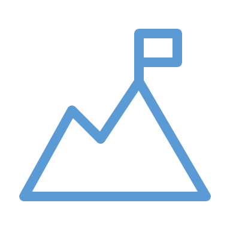

# Purpose

<!--
What is the purpose of collecting data, creating information, and acquiring knowledge?

Essentially, what makes data so important in data science?
-->

---

<!-- _class: title-two-content-left -->

# Purpose

Data alone is useless
Used to achieve a goal
Transform data to action

<!--
[1] Data, on it's own, is useless. 

[2] However, it can be a stepping stone to achieve a goal or an objective of some kind.

[3] In order to achieve our goal we need to transform data into something that is actionable.

We need to transform our data into actionable insight.
-->

---

<!-- _class: title-one-content-left -->

# Purpose

Data

Info

Knowledge

Decision

Action

<!--
We do this through the following process:

[1] First, we collect data by observing the world and recording our observations.

[2] Next, we organize, analyze, and interpret our data to create information.

[3] Then, we combine this information with other information to create knowledge.

[4] Next, we use this knowledge and new information to make an informed decision about which action to take.

[5] Then, we can take action with the confidence that we have increased the likelihood of achieving our goal.
-->

---

<!-- _class: title-two-content-left -->

# Purpose

Transforming data to actionable insight
Data-driven decision making
Intelligence

<!--
[1] In data science, we refer to this process as "transforming data into actionable insight".

[2] In the world of business, this is often referred to as "data-driven decision making".

[3] In our daily lives, we simply refer to this process as "intelligence": ...

... the use of knowledge and new information to make rational decisions about actions that will maximize our chances of achieving a goal.
-->