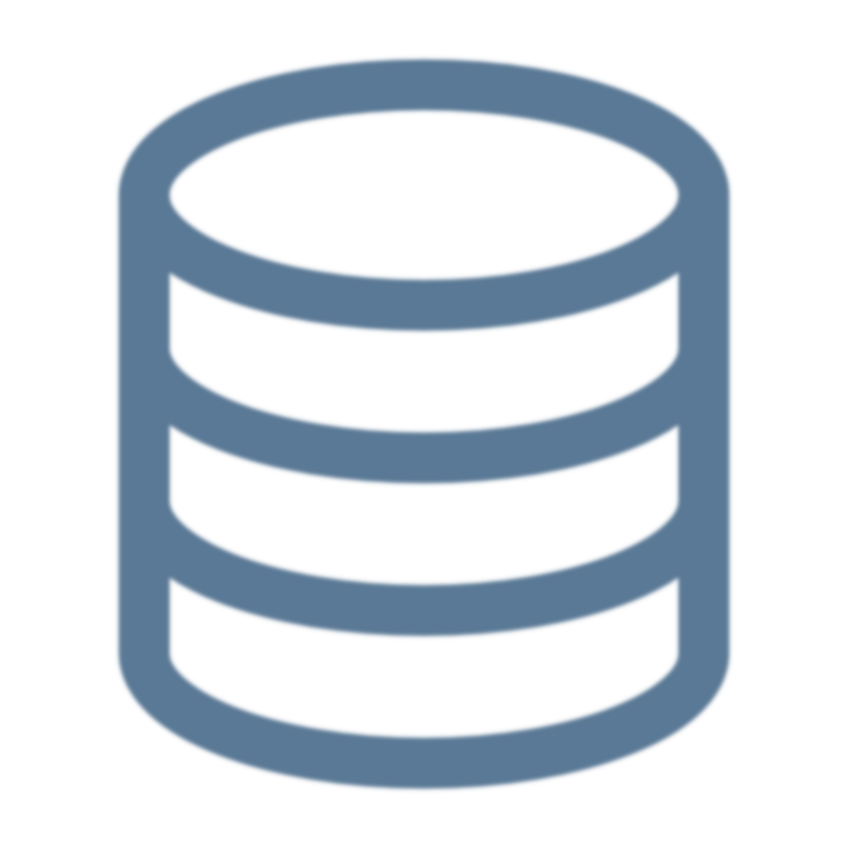

# Summary

<!--
In this module we learned about data ... we learned what it is and why it's important.
-->

---

<!-- _class: title-five-content -->

# Summary

Data

Information

Knowledge

Purpose

Process

<!--
[1] First, we learned that data are raw and unorganized facts created from recording observations of the world around us.

[2] Next, we learned that information is data that has been organized, analyzed, and interpreted to provide it with additional context and meaning.

[3] Then, we learned that knowledge is a collection of information that can be used to solve problems in a specific domain.

[4] Next, we learned that the purpose of data is to make intelligent, rational decisions that lead to actions that achieve a goal of some kind.

Finally, we learned that the data-driven decision-making process involves transforming data, into information, into knowledge, to a decision, and finally, to an action that achieves a goal.

In the next module, we're learn about data types and how data are stored in computer systems.
-->