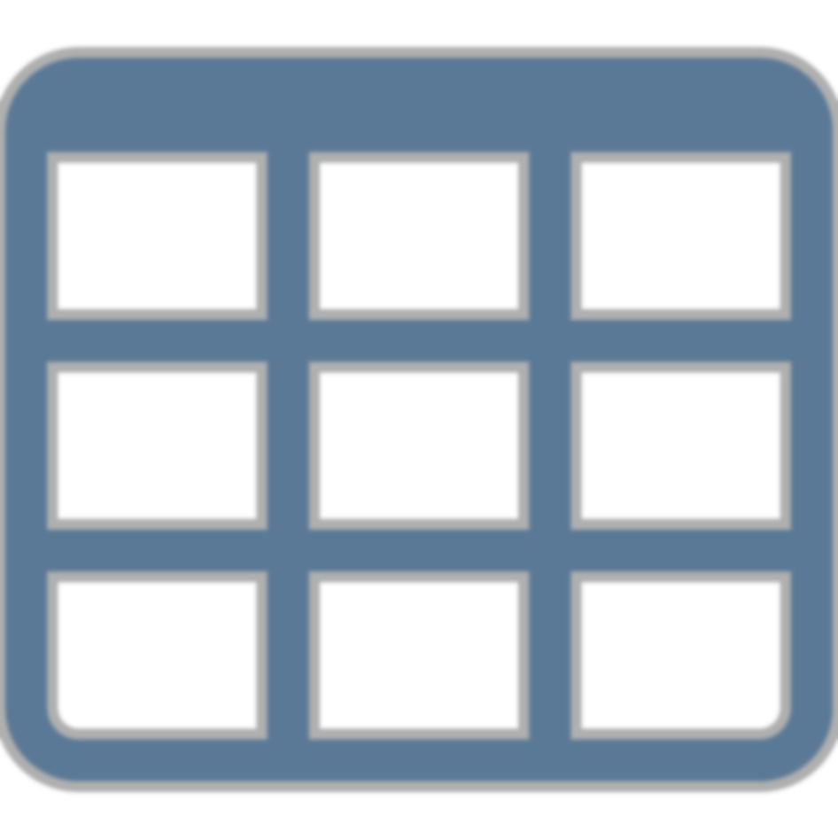

# Tabular Data

<!--
Tabular data are the most common form of structured data that we use for analysis in data science.

But what are tabular data and how do we organize our data in this way?
-->

---

<!-- _class: title-two-content-left -->

# Tabular Data

Data organized into a table
Table is a grid of data
Column must be same type
Row can contain many types

<!--
[1] Tabular data are data organized into a table.

The table provides the data with structure.

[2] A table, is a two-dimensional grid of data.

However, unlike a matrix, which we saw earlier, all of the elements in a table *do not* need to be all of the same data type 

[3] Rather, all data *in each column* must be the same data type, which we refer to as homogenous data.

[4] However, all data *in a row* can have different data types, from column to column, which we refer to as heterogenous data.
-->

---

<!-- _class: title-two-content-left -->

# Tabular Data

<!--
For example, imagine we have a table of patients at a hospital.

We would have a set of rows (one for each patient) and a set of columns, (one for each attribute of the patient).

Each element of data in a column must be the same data type.

For example, 

 - all of the names must be character strings.

 - all of the genders must be enumerations of male, female, or other genders.

 - all ages must be integers...

 - and so one.

However, the each row contains elements of various data types.

For example, 

 - the name "Bill" is a character string, 

 - the gender "Male" is an enumeration

 - and the age "21" is an integer

As we can see, each column contains only a single data type; however, each *row* can contain multiple data types.
-->

---

<!-- _class: title-three-content -->

# Tabular Data

Observations

Variables

Relationships

<!--
In data science, tabular data can be broken down into three main components:

[1] Observations - which we locate on the rows of a table

[2] Variables - which we locate on the columns of a table

[3] and Relationships - which connect data in one table to data in another table

We'll discuss each of these components, in more detail, next.
-->