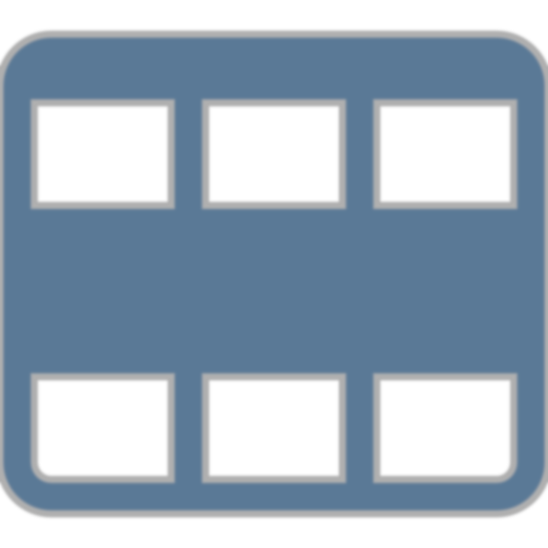

# Observations

<!--
Data science is founded upon making observations of the world around us.

But what are observations and how do we record them in tabular data?
-->

---

<!-- _class: title-two-content-left -->

# Observations

Recording
On the rows

<!--
[1] An observation is a recording of the qualities and quantities of an observable phenomenon in the natural world.

This includes what we can see, hear, feel, or measure with sensors.

[2] In data science, we record observations on the rows of a table.

The rows are the horizontal groups of data that are contained within the table.
-->

---

<!-- _class: title-two-content-left -->

# Observations

Recording
On the rows
Same observation
One per row

<!--
For example, imagine that we are recording the vital signs of a patient at a hospital.

For each observation, we would record the date of the observation, the patient's heart rate, their temperature, and other vitals.

Each of these observations would be recorded on a separate row.

[3] What is important to note is that all of the elements in a row of data belong to the same observation.

For example, a row of data can be an observation of a person, a place, a thing, or a set of sensor readings at a specific time.

[4] In data science, we want each row to contain one and only one observation.

Essentially, each row should record one, and only one, person, place, or thing begin observed at a given time.
-->

---

<!-- _class: title-two-content-left -->

# Observations

Rows
Tuples
Records

<!--
Outside of data science, the rows of a table of data go by various names.

[1] First, you may hear them simply referred to as "rows", for, well, obvious reasons, I guess.

[2] In computer science, they are often referred to as a tuples (or a tupples), which is a mathematical term for a list of data.

[3] Or you may often hear them referred to simply as "records", because they store a recording of an observation, entity, or transaction of some kind.

No matter what they are called, observations should always be represented as rows in tabular data.
-->