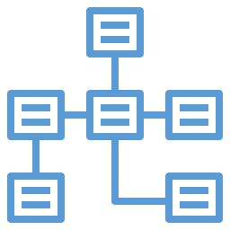

# Summary

<!--
In this module, we learned about tabular data... and how we can extract information from tables of data using queries.
-->

---

<!-- _class: title-five-content -->

# Summary

Tabular Data

Observations

Variables

Relationships

Queries

<!--
[1] First, we learned that tabular data are data that are organized into tables consisting of rows and columns.

[2] Next, we learned that observations are records of observable phenomena, which are stored on the rows.

[3] Then, we learned that variables contain values that vary across each observation, which are stored on the columns.

[4] Next, we learned that we can create relationships between observations in two or more tables by using primary and foreign keys.

[5] Finally, we learned that queries allow us to ask questions of tabular data and return answers in the form of information.

In the next module, we'll learn about the data life cycle... the journey of data as it is transformed from raw data to actionable insight.
-->