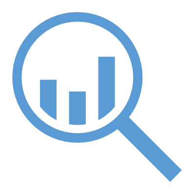

<!-- _class: title-only -->

# Life Cycle

<!--
Welcome back to this introductory course on data for data science.

I'm Matthew Renze, data science consultant, author, and public speaker.

In this module, we'll learn about the life cycle of data ...

... the journey of data as we move from data collection to action.
-->

---

<!-- _class: title-only -->

# How do we get from data to action?

<!--
How do we get from data collection to action in data science?

What does the journey of data look through these various stages?

And what are the tools and methods involved in this process?
-->

---

<!-- _class: title-six-content -->

# Overview

Collection

Storage

Processing

Analysis

Action

Repeat

<!--
To answer these questions, we're going to follow the journey of data from data collection to action.

[1] First, we'll learn about data collection and how we record observations of our world.

[2] Next, we'll learn about data storage, and the various types of data repositories we encounter.

[3] Then, we'll learn about data processing, and steps we perform to prepare our data for analysis.

[4] Next, we'll learn about data analysis, and the many tools we can use to analyze data.

[5] Then, we'll learn about taking action based on the results of our analysis.

[6] Finally, we'll learn about how we repeat this process, using feedback as our guide, to optimize over time.
-->