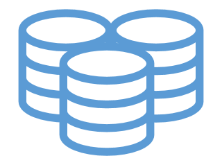

# Storage

<!--
The second step in the data lifecycle is data storage.
-->

---

<!-- _class: title-two-content-left -->

# Storage

Volatile storage
Persistent storage
Retrieve as needed

<!--
Once we've collected and recorded an observation as data, we need to store it so that it can be retrieved for future analysis.

[1] As data are being recorded by sensors, these data are first recorded temporarily in a type of memory called volatile storage.

Volatile storage means that the data are lost when the device loses power.

As a result, we need to transfer our data somewhere more permanent, so that they will be available anytime we need them.

In data science, we store our data in one of several persistent-storage mediums.

[2] Persistent storage, means that the device retains the data after the power to the device has been shut off.

For example, a computer's hard drive retains its data even if you turn the power off and then turn it back on again.

[3] By storing our data in a persistent storage medium, we can retrieve our data as needed.

Unless we overwrite the data, or the device permanently fails, our data should always remain available.
-->

---

<!-- _class: title-five-content -->

# Storage

File-based formats

Web-based formats

Transactional databases

Analytical databases

Big Data platforms

<!--
Data can be stored in computers in several ways:

[1] First, we have file-based formats - which store data in files on the filesystem of a computer.

For example, comma-separate values (or CSV) files and Excel spreadsheets.

[2] Next, we have web-based formats - which store data in formats best suited for data transfer over the internet.

For example, eXtensible markup language (or XML) and javascript-object notation (or JSON)

[3] Third, we have transactional databases - which store data in a form best suited for transaction processing.

For example, normalized relational databases and No-SQL databases.

[4] Forth, we have analytical databases - which store data in a format best suited for analytical processing.

For example, data warehouses, data marts, and data cubes.

[5] And finally, we have Big Data platforms - which can store massive data sets by distributing both data and processing across many computers

For example, Spark, Hive, and Hadoop.

There are many options to choose from, so it's important to know which option is right for your specific data-storage scenario.
-->