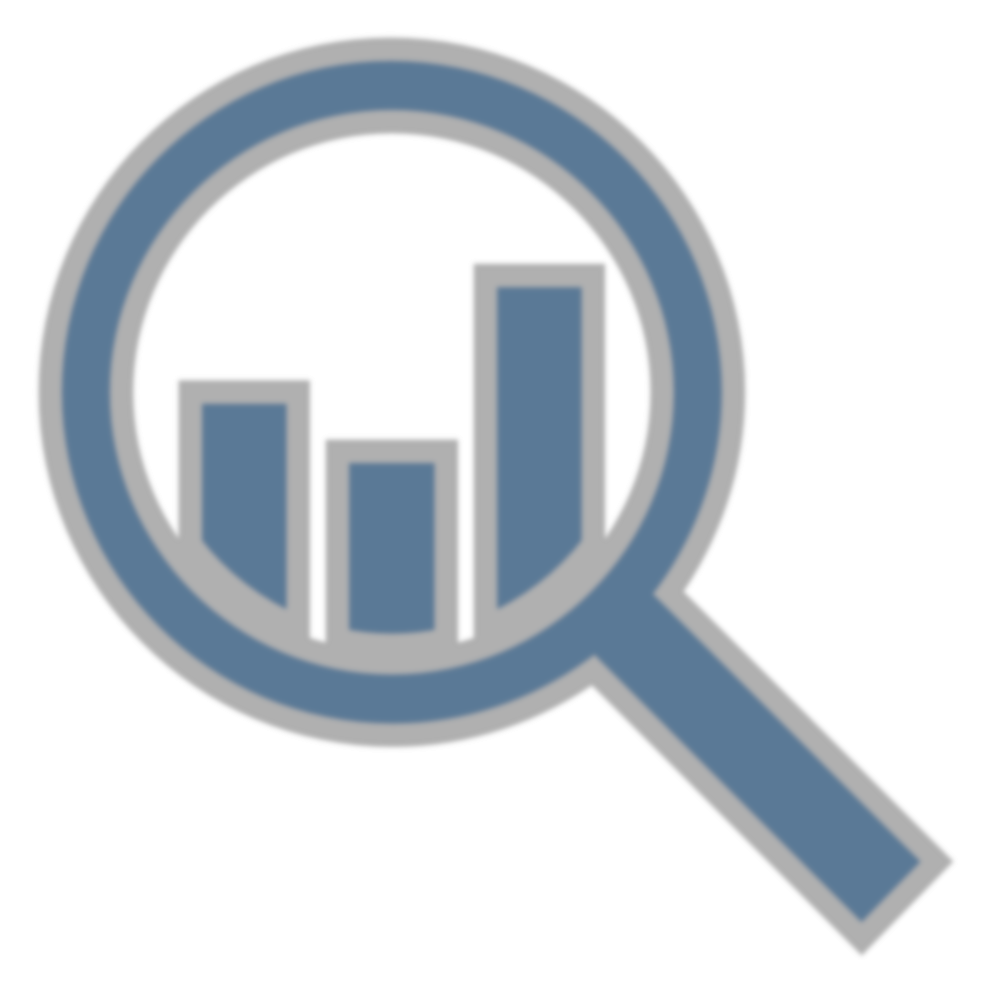
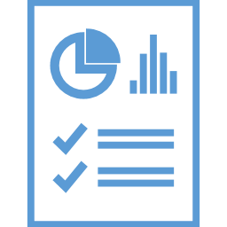

# Analysis

<!--
The fourth step in the data lifecycle is data analysis.
-->

---

<!-- _class: title-two-content-left -->

# Analysis

Support decisions
Explain observations
Discover information

<!--
Once we've processed our data, we want to analyze them to create new information that we can act upon.

There can be many reasons to perform a data analysis.

For example:

[1] to provide support for or against decisions that we need to make,

[2] to explain observations and behaviors that we see occurring,

[3] and to discover new information from patterns that exist in the data.
-->

---

<!-- _class: title-six-content -->

# Analysis

Reports

Dashboards

Analytics

Data mining

Machine learning

Artificial intelligence

<!--
There are numerous ways we can analyze data, for example:

[1] We can create reports, which allow us to analyze both numerical and graphical information.

[2] We can create dashboards, which present key-performance indicators (or KPIs) through a series of visual widgets.

[3] We can perform interactive data analysis, using business intelligence tools (like Excel, Power BI, and Tableau).

[4] We can perform data mining, which uses computer algorithms to find patterns of interest in large data sets.
 
[5] We can perform machine learning, which involves humans training computer algorithms to detect patterns in new incoming data.

[6] And we can automate data analysis with data-driven artificial intelligence, which involves machines teaching themselves how to solve problems on their own.

There are many ways that we can analyze data, so it's important that we choose the right tool for each type of data analysis we perform.
-->