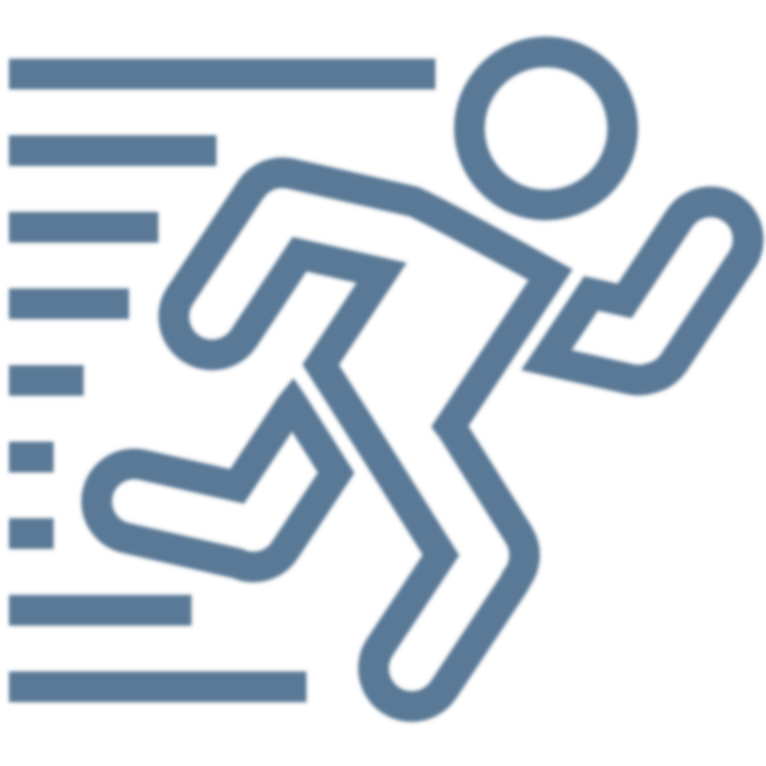
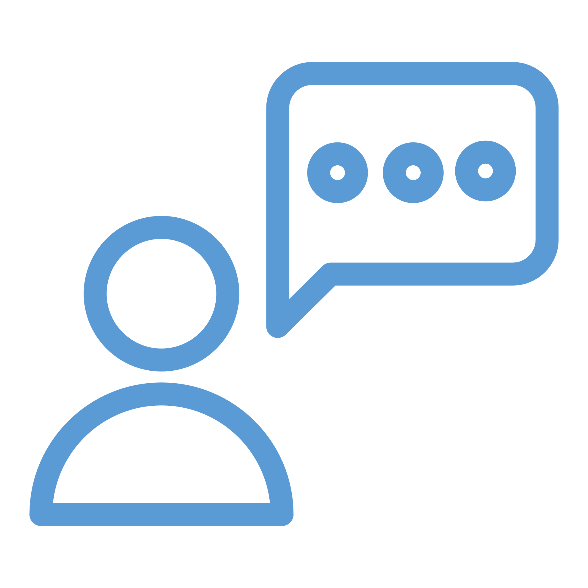
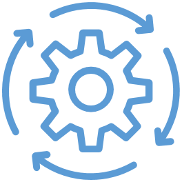
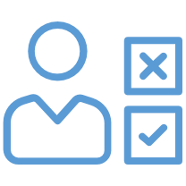

# Action

<!--
The next step in the data lifecycle is action.
-->

---

<!-- _class: title-two-content-left -->

# Action

Decision
Action
Outcome

<!--
Knowledge for the sake of knowledge is a noble pursuit and valuable in it's own right.

However, in order for data to be valuable to our business, it must lead to some form of action.

So, in data science we use the results of our data analysis to take an action of some kind.

[1] This stage begins with making a decision on what action to take based on the data and our analysis.

This may also include making the decision *not* to act (i.e. choosing inaction based on our analysis).

[2] Next, we take the appropriate action in order to affect positive change.

For example, we might approve a customer for a loan, recommend a product on our website, or change a business process.

[3] Finally, this stage ends with an outcome which is either positive, negative, or resulted in no change at all.

We need to observe and record the outcome of our actions as data, because we're going to use this outcome in the final step in our process.
-->

---

<!-- _class: title-three-content -->

# Action

Decide

Communicate

Automate

<!--
Action from data can take on many forms.

For example:

[1] We can make a decision based upon our own data analysis and then act upon our decision.

[2] We can communicate our findings to a wider audience in order to encourage others to take a specific action.

[3] or we can automate a decision-making process with a computer so that the action happens automatically when the right pattern of data are observed by the machine.

No matter who is performing the action, we always want to make sure that we've chosen the best action given the data.
-->