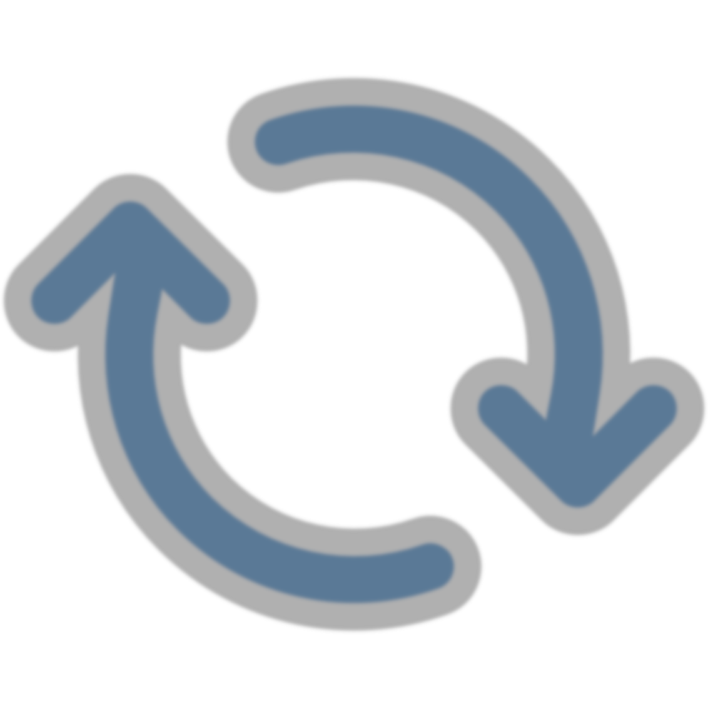

# Repeat

<!--
The final stage in the data lifecycle is to repeat the process.
-->

---

<!-- _class: title-two-content-left -->

# Repeat

Feedback
Iterative process 
Continuous improvement

<!--
As I mentioned in the previous step, it's important that we observe the outcome of our actions to see whether they made a positive impact, a negative impact, or led to no change at all.

[1] We want to use this information as feedback to drive the next iteration of the process.

Feedback is very important in data science - it tells us whether we're steering the ship in the right direction or headed towards a giant cliff.

[2] Data science is a highly iterative process, so we are typically repeating this feedback loop over and over on a regular basis.

The faster we can receive valuable feedback, the quicker we can make course corrections, and the sooner we can achieve our goals.

[3] We want to use this feedback loop to drive continuous improvement in our business processes over time.

Essentially, this is how we optimize any business process... by continuously improving it over time using feedback.
-->

---

<!-- _class: title-two-content-left -->

<!--
[NOTE FOR FUTURE: Change [5] to mention "action"]

However, it's critically important to note that the success of this data-driven process is based on all of the steps that came before it.

So we need to ensure that:

[1] we've collected reliable data from our observations, 

[2] we've stored them correctly in the right type of persistent storage, 

[3] we've processed them correctly using the right tools and methods, 

[4] we've analyzed them correctly using the right tools and methods, 

[5] we've made a rational decision based on results of our analysis,

[6] and we've repeated this process using outcomes of our actions as feedback.

Performing all of these steps correctly is a bit more difficult than it sounds. 

This is why it's so important that you learn the rest of the details of data science:

... so that you can always choose the best possible action given the data.
-->