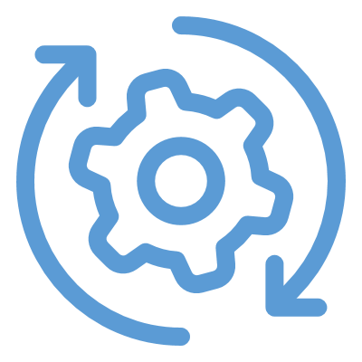
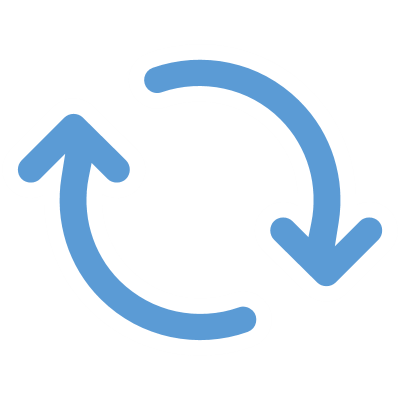

# Summary

<!--
In this module, we learned about the data life cycle... the journey of data from inception to action.
-->

---

<!-- _class: title-six-content -->

# Summary

Collection

Storage

Processing

Analysis

Action

Repeat

<!--
[1] First, we learned about data collection and how we record observations of our world.

[2] Next, we learned about data storage, and the various types of data repositories we encounter.

[3] Then, we learned about data processing, and the steps we perform to prepare our data for analysis.

[4] Next, we learned about data analysis, and the many tools we can use to analyze our data.

[5] Then, we learned about taking action based on the results of our analysis.

[6] Finally, we learned about how we repeat this process, using feedback as our guide, to optimize over time.

In the next module, we'll wrap things up for this course and learn where to go next to continue our *own* data-science journey.
-->