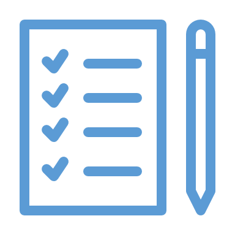

<!-- _class: title-only -->

# Conclusion

<!--
Welcome to the final module of this introductory course on data for data science.

I'm Matthew Renze, data science consultant, author and public speaker.

Now let's wrap things up for this course ... 

... so we can get started on our next course ...

... and begin applying this knowledge in the real world.
-->

---

<!-- _class: title-only -->

# Where should I go next?

<!--
You might be wondering:

Where should I go next?

What should I do to apply what I just learned?

And where should I go if I have questions or feedback?
-->

---

<!-- _class: title-two-content -->

# Practice

Quizzes

Exercises

<!--
First, I recommend that you practice to reinforce the information that you've learned.

[1] So please complete all of the quiz questions ...

[2] ... and practice exercises for this course before you move on.

After years of research, and my own personal experience, we know that humans don't effectively learn new information unless they practice using it.

In fact, we forget about half of the information we've been taught within a hour of learning it and 75% within a few days.

However, if we practice, it reinforces the information and helps solidify it in our long-term memory.

This is the most effective way to maximize your learning and the value you derive from this course.
-->

---

<!-- _class: title-two-content -->

# Learn More

Foundations of Data Science

http://matthewrenze.com/courses/

<!--
[1] Next, if you're interested in learning more, I recommend taking the remaining courses in this series on data science.

This series contains all of the knowledge you will need to get started on your data-science journey. 

[2] You can find an up-to-day list of courses and a learning path to guide you at the following URL.

There's plenty more to learn, so be sure to get started right away!
-->

---

<!-- _class: title-four-content -->

# Engage the Community

Rate

Question

Comment

Feedback

http://matthewrenze.com/contact/

<!--
Finally, I encourage you to engage with me and others in this online learning community.

So please be sure to:

[1] rate this course

[2] Ask questions in the discussion board

[3] Leave comments to let me know what you found valuable and what could be improved

[4] and feel free to send me a message on social media if you'd like to provide me with feedback in public.

[5] All of my social media handles can be found on my website at the following URL.
-->