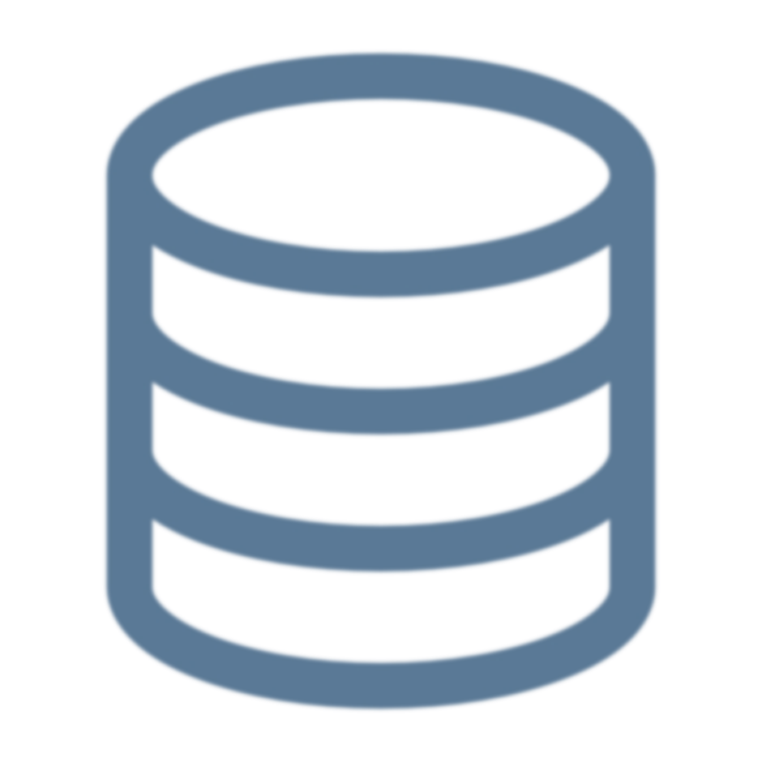

# Summary

<!--
Finally, let's summarize the key concepts that we learned in the course.
-->

---

<!-- _class: title-five-content -->

# Summary

Data

Types of Data

Data Types

Tabular Data

Data Life Cycle

<!--
In this course, we learned about data as a foundation for data science.

[1] First, we learned that data are a collection of facts that describe observations of the world around us.

[2] Next, we learned that there are various types of data ... including categorical and numerical data.

[3] Then, we learned that data can be represented and stored in computers using data types.

[4] Next, we learned that tabular data are data organized into rows and columns so that they can be queried effectively.

[5] Finally, we learned that data moves through a life cycle as a journey from data collection to action.
-->

---

<!-- _class: title-two-content-left -->

# Thank You!

Matthew Renze
Data Science Consultant
Renze Consulting

Twitter: @matthewrenze
Website: matthewrenze.com

<!--
Thank you for joining me for this introductory course on data for data science.

I hope that you have found this information valuable ...

... and that it has helped you move forward on your data-science journey.

Please be sure to keep in touch via my website and social media ...

... and I hope to see you again in another course in the near future.

[Play outro music]
-->

---

<!-- _class: title-two-content-left -->

data science made simple

http://renzeconsulting.com