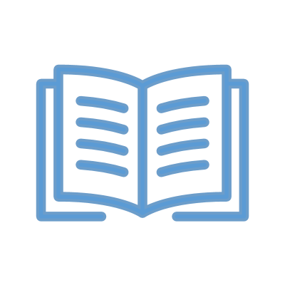

<!-- _class: title-only -->

# Knowledge

<!--
Sir Francis Bacon famously said that "knowledge is power";

But what makes knowledge so powerful?

And what exactly is knowledge in the first place?
-->

---

<!-- _class: title-two-content-left-center -->

# Knowledge

Understanding of our world
Explains observations
Predicts behavior

<!--
[1] Knowledge is a theoretical or practical understanding of the natural world around us.

[2] It explains the observations that we see and why things behave the way they do.

[3] In addition, it allows us to predict the behavior of phenomena in our world.

Both of which, are quite beneficial to our survival and our ability to thrive in the world.
-->

---

<!-- _class: title-two-content-left-center -->

# Knowledge

Created from information
Used to solve problems
Used to make decisions

<!--
[1] Knowledge is created from information.

It is essentially a collection of information that has been organized to provide a consistent and cohesive understanding of a specific topic.

[2] From a more pragmatic standpoint, knowledge is used to solve problems within a specific domain.

[3] Knowledge allows us to make decisions so that we can take an action that leads us to a goal of some kind.
-->

---

<!-- _class: one-pane -->

<!--
[1-2] For example, imagine that our doctor knows that when a person's body temperature rises to 39°C, that they are likely fighting an infection.

This relationship between an increase in body temperature and the presence of an infection is what we refer to as knowledge.

In the case of our example, our doctor would use this knowledge to decide that we are most likely fighting an infection. 

[3] As a result of this knowledge, they would likely take the action of recommending that we get plenty of rest, drink lots of fluids, and potentially get further testing if necessary.
-->

---

<!-- _class: title-two-content-left-center -->

# Knowledge

Knowledge alone is not enough
Knowledge + new information
Combination leads to solution

<!--
[1] Knowledge alone isn't enough to solve problems.

[2] In order to solve real-world problems, we need to use knowledge in combination with new information.

[3] It's this combination of existing knowledge and new information that leads to a solution to a problem.

For example, our doctor used a combination of their existing medical knowledge and new information about our current body temperature to decide that we were likely fighting an infection and recommend a course of treatment.
-->
