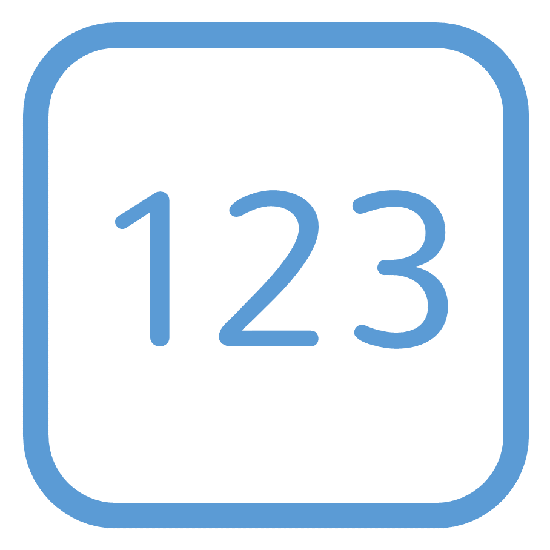

<!-- _class: title-only -->

# Scalar Data Type Examples

<!--
In data science, we have several common scalar data types.

We're going to learn at the ones that you're most likely to encounter.
-->

---

<!-- _class: title-two-content-left-center -->

# Categorical Data Types

Character: ABC
Boolean: True/False
Enumeration: 1-A, 2-B, 3-C

<!--
First, we have categorical data types.

We typically encounter three categorical data types in data science.

[1] First, we have a character, which represents a single letter, digit, or symbol.

We can string together a sequence of characters (called a character string) to represent words, numbers, and bodies of text.

Character strings are very flexible for storing data, but they are not very efficient in terms of data processing and storage space.

[2] Second, we have a Boolean, which represents either a true or a false value (and only a true or a false value).

Booleans allow us to efficiently store and process data composed of either yes or no answers.

[3] Third, we have an Enumeration, which represents a set of named categories.

Enumerations allow us to efficiently store and process lists of named categories that contain a high degree of duplication.
-->

---

<!-- _class: title-two-content-left-center -->

# Numerical Data Types

Integer: 123
Decimal: 1.23
Float: 1.2 x 10^3

<!--
Next, we have numerical data types.

We typically encounter three numerical data types in data science.

[1] First, we have an integer, which represents a whole number.

Integers work well for storing and processing numbers that do not contain fractional values.

[2] Second, we have a decimal, which represents a decimal fraction.

Decimals work well when we're dealing with fractional values (like money) that require perfectly accurate decimal arithmetic.

[3] Third, we have a float, which represents numbers using a binary-equivalent of scientific notation.

Floats work well when we're dealing with very large or very small values but perfectly accurate measurements and arithmetic are not required.
-->

---

<!-- _class: title-two-content-left-center -->

# Temporal Data Types

Date: 2001-02-03
Time: 01:02:03
Date/time: 2023-01-02 01:02:03
2023-01-02T01:02:03-04:00

<!--
Finally, we have temporal data types.

We typically encounter four temporal data types in data science.

[1] First, we have a date, which represents time as a calendar day.

A Date data type works well when we just need to specify a year, a month, and a day but nothing more.

[2] Second, we have a time data type, which represents a time of day.

A time data type is used when we just need to represent an hour, a minute, a second, and milliseconds but not a date.

[3] Third, we have a date-time data type, which represents both a date and a time of day.

This data type is used when we need to represent time across days.

[4] Fourth, we have a date-time with time-zone offset.

This data type is used when we need to represent dates and times across multiple time-zones around the world.

We could represent temporal data using numerical data types, however, it's often more efficient and convenient to use these specialized temporal data types instead.

There are several other scalar data types you may encounter in data science. 

However, the data types you've seen here are ones that you are most likely to encounter first.
-->