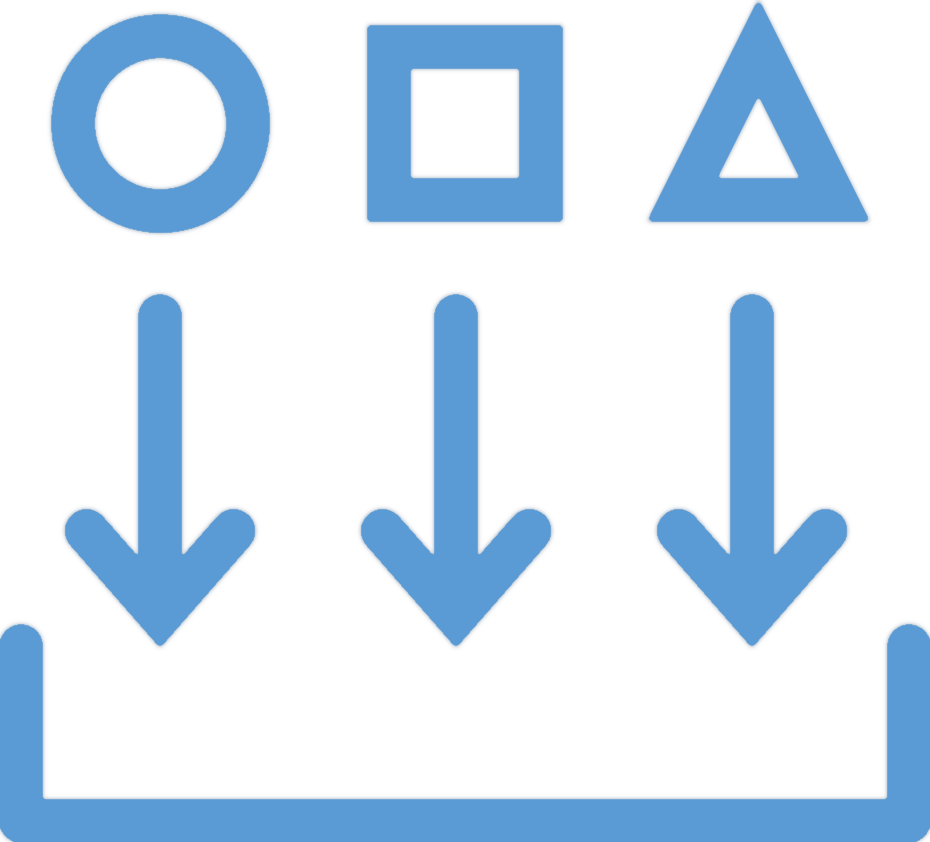

<!-- _class: title-only -->

# Collection

<!--
The first step in the data lifecycle is data collection.
-->

---

<!-- _class: title-two-content-left-center -->

# Collection

Observe phenomenon
Record observation
Both are required

<!--
We collect data about our world in a two-step process:

[1] First, we observe a phenomenon that exists in the natural world.

This includes sensing the various qualities of the things we're observing and measuring their quantities as well.

[2] Next, we record this observation using a symbolic representation.

In data science, this typically involves encoding the observation in a computer as a binary representation.

[3] It's important to note that data do not exist until there has been both an observation and a recording of the observation.

Data are created as the result of something being observed and recorded as a signal or set of symbols.

Prior to a recording of an observation, there is no data, just the phenomenon that exists in the world.
-->

---

<!-- _class: title-two-content-left-center -->

# Collection

Sensors
Transactions
Interactions
Experiments

<!--
There are several ways we can observe our world to collect data:

[1] We can use sensors to record measurements of observable phenomena.

For example, we can record observations of the ambient air temperature using a digital thermometer.

[2] We can enter data into a transactional system, to record business transactions.

For example, we can create records for new customers, record sales transactions, and create medical records.

[3] We can also record human interactions with computer systems.

For example, we can record website visits, advertisement clicks, and time spent browsing a webpage.

[4] And we can run experiments in order to generate new data in controlled environments.

For example, we can run clinical studies to determine the effectiveness of certain medications.

High quality data begins with data collection, so it's important to know how to properly observe and record data.
-->