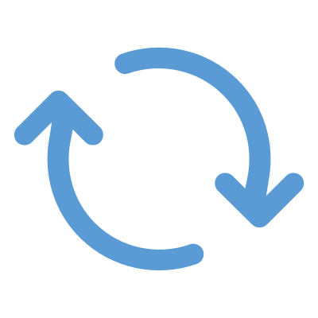

<!-- _class: title-only -->

# Repeat

<!--
The final stage in the data lifecycle is to repeat the process.
-->

---

<!-- _class: title-two-content-left-center -->

# Repeat

Feedback
Iterative process 
Continuous improvement

<!--
As I mentioned in the previous step, it's important that we observe the outcome of our actions to see whether they made a positive impact, a negative impact, or led to no change at all.

[1] We want to use this information as feedback to drive the next iteration of the process.

Feedback is very important in data science - it tells us whether we're steering the ship in the right direction or headed towards a giant cliff.

[2] Data science is a highly iterative process, so we are typically repeating this feedback loop over and over on a regular basis.

The faster we can receive valuable feedback, the quicker we can make course corrections, and the sooner we can achieve our goals.

[3] We want to use this feedback loop to drive continuous improvement in our business processes over time.

Essentially, this is how we optimize any business process -- by continuously improving it over time using feedback.
-->

---

<!-- _class: title-two-content-left-center -->

# Repeat

Collect
Store
Process
Analyze
Decide
Repeat

<!--

However, it's critically important to note that the success of this data-driven process is based on all of the steps that came before it.

So we need to ensure that:

[1] we've collected reliable data from our observations, 

[2] we've stored them correctly in the right type of persistent storage, 

[3] we've processed them correctly using the right tools and methods, 

[4] we've analyzed them correctly using the right tools and methods, 

[5] we've made a rational decision based on results of our analysis,

[6] and we've repeated this process using outcomes of our actions as feedback.

Performing all of these steps correctly is a bit more difficult than it sounds. 

This is why it's so important that you learn the rest of the details of data science -- so that you can always choose the best possible action given the data.
-->